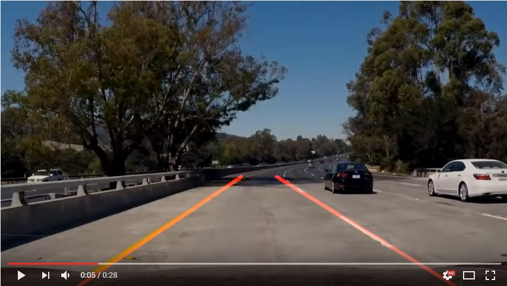

# **CarND-LaneLines-P1** 
Finding Lane Lines on the Road

#### The goal of this project is to make a pipeline that finds lane lines on the road. Either images or video can be input to test the pipeline. The project is done in [Python with OpenCV](https://pypi.python.org/pypi/opencv-python) library and can be opened in [Jupyter Notebook](https://www.packtpub.com/books/content/basics-jupyter-notebook-and-python).

 

 

## For a detailed discussion go to this [blog post](http://tomaszkacmajor.pl/index.php/2017/05/17/first-step-stay-track-lane-lines-detection/) about the project.
