#**CarND-LaneLines-P1** 
Finding Lane Lines on the Road

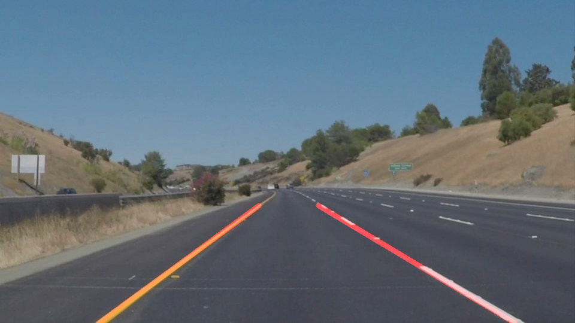

####The goal of this project is to make a pipeline that finds lane lines on the road. Either images or video can be input to test the pipeline. The project is done in [Python with OpenCV](https://www.packtpub.com/books/content/basics-jupyter-notebook-and-python) library and can be opened in [Jupyter Notebook](https://pypi.python.org/pypi/opencv-python).

##1. Pipeline description
My pipeline consists of 10 steps:</br>
1. [Reading image or video frame](#reading-image-or-video-frame)</br>
2. [Filtering white and yellow colors](#filtering-white-and-yellow-colors)</br>
3. [Conversion to grayscale](#conversion-to-grayscale)</br>
4. [Gaussian blurring](#gaussian-blurring)</br>
5. [Edge detection](#edge-detection)</br>
6. [Region of interest definition](#region-of-interest-definition)</br>
7. [Hough lines detection](#gaussian-blurring)</br>
8. [Filtering Hough lines](#filtering-hough-lines)</br>
9. [Averaging line segments](#averaging-line-segments)</br>
10. [Applying moving  average on final lines](#applying-moving -average-on-final-lines)</br>
</br>
###Reading image or video frame
The main method processing the image takes its path as argument. The image is loaded using *matplotlib.image*. 
```python
def draw_lanes_image(imageName):
    image = mpimg.imread(imageName)
```
```python
import os
for img in os.listdir("test_images/"):
   draw_lanes_image("test_images/"+img)
```

Below, there are 3 examples of loaded images. Later, after each step, intermediate results will be shown for these images. The third one is the most demanding to process as there are shadows and not so big contrasts between yellow line and the road.</br>


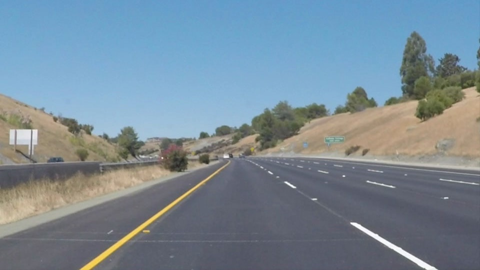
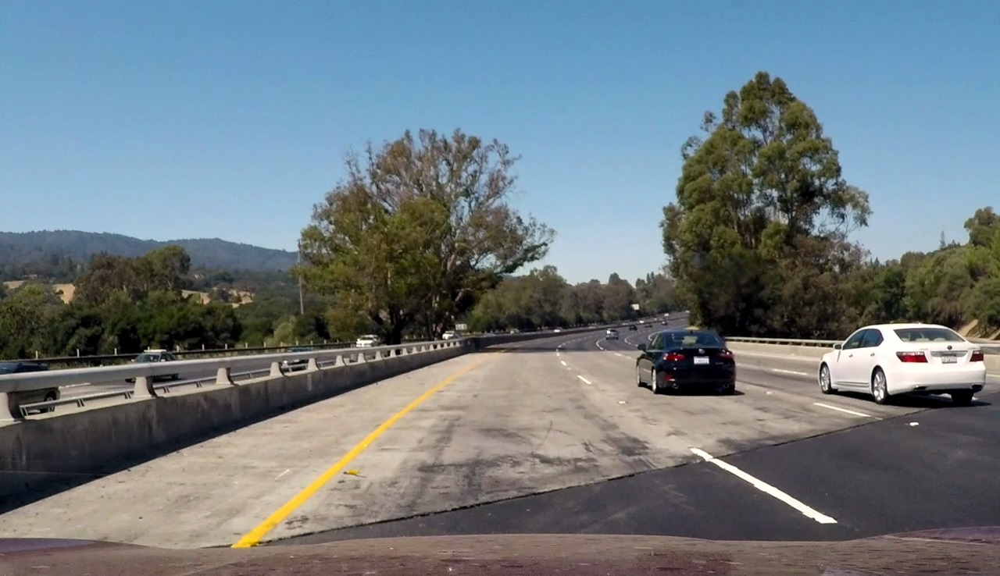

---
###Filtering white and yellow colors
This step wouldn't be necessary for the first two easier images. In the third example, after gray scale conversion, color difference between the yellow line and the road is very small. Thus the idea of filtering only 2 key colors to detect all required lanes. Firstly, the image is converted to [HSL color space](https://en.wikipedia.org/wiki/HSL_and_HSV). HSL (Hue, Saturation, Lightness) color space concept is based on human vision color perception. This is  why it's easier to differenciate desired colors (yellow and white) even if there are shadows on the image. The code below is inspired by similar [project](https://github.com/naokishibuya/car-finding-lane-lines).
```python
def convert_hls(img):
    return cv2.cvtColor(img, cv2.COLOR_RGB2HLS)
    
def mask_white_yellow(image):
    converted = convert_hls(image)
    # white color mask
    lower = np.uint8([  0, 200,   0])
    upper = np.uint8([255, 255, 255])
    white_mask = cv2.inRange(converted, lower, upper)
    # yellow color mask
    lower = np.uint8([ 10,   0, 100])
    upper = np.uint8([ 40, 255, 255])
    yellow_mask = cv2.inRange(converted, lower, upper)
    # combine the mask
    mask = cv2.bitwise_or(white_mask, yellow_mask)
    whiteYellowImage = cv2.bitwise_and(image, image, mask = mask)
    return whiteYellowImage
```
```python
whiteYellowImage = mask_white_yellow(image)
```
Below, there are test images after color filtering.</br></br>
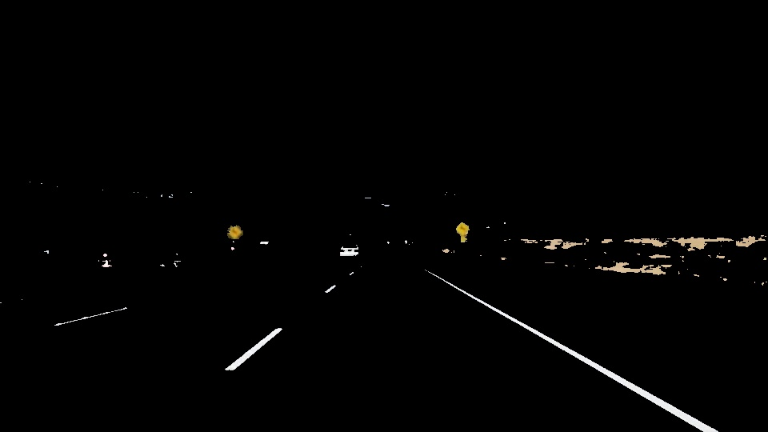
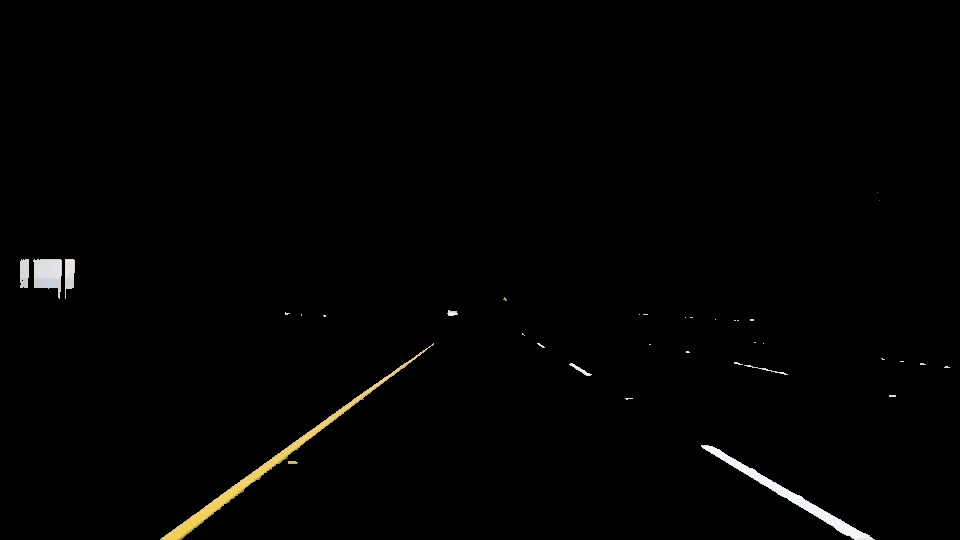
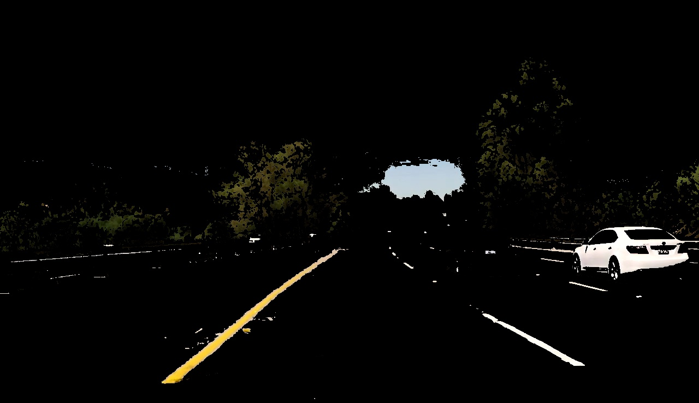

---
###Conversion to grayscale

As in many computer vision application, the image is converted to grayscale. It's mainly for the simplicity and speed of further operations.
```python
def grayscale(img):    
    return cv2.cvtColor(img, cv2.COLOR_RGB2GRAY)
```
```python
grayImage = grayscale(whiteYellowImage)
```
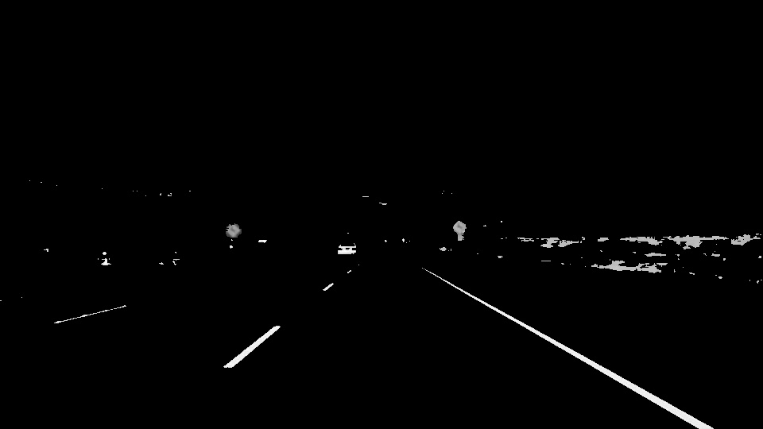

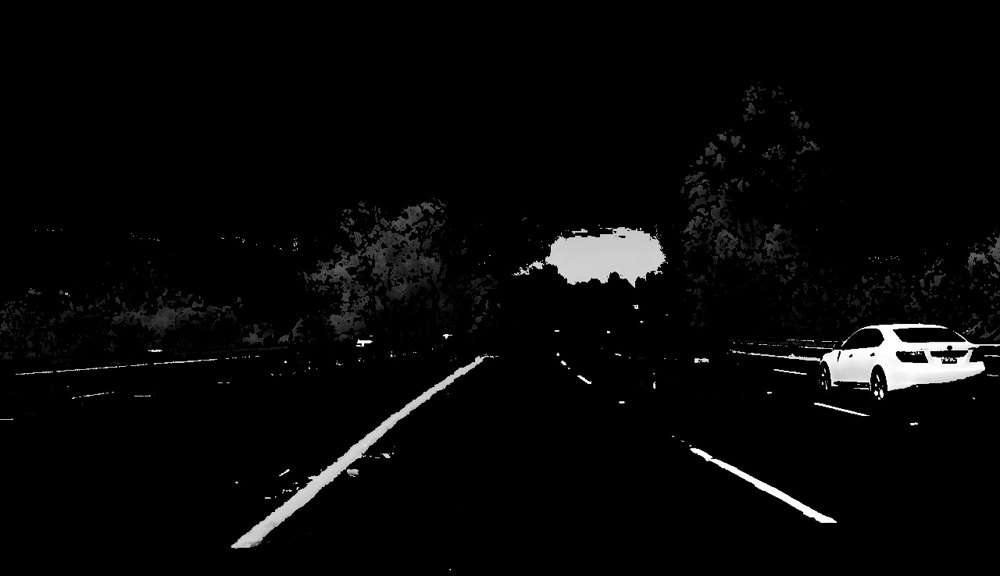

---
###Gaussian blurring
To supress noise and spurious gradients Gaussian smoothing is applied. By experiments, kernel of size 5 was chosen. 
```python
def gaussian_blur(img, kernel_size):
	return cv2.GaussianBlur(img, (kernel_size, kernel_size), 0)
```    
```python
blurredImage = gaussian_blur(grayImage, 5)
```
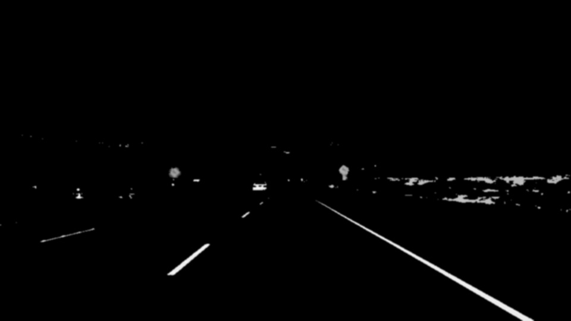
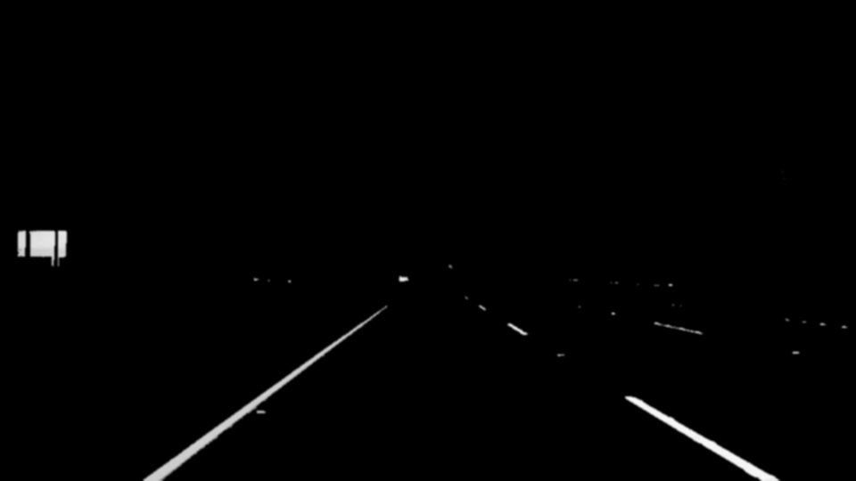


---
###Edge detection

To detect edges, let's use popular [Canny](http://docs.opencv.org/2.4/modules/imgproc/doc/feature_detection.html?highlight=canny#canny) method. It's called with 2 parameters: low and high thresholds which define how strong the gradients should be to classified as edge.

```python
def canny(img, low_threshold, high_threshold):
    return cv2.Canny(img, low_threshold, high_threshold)
```
```python
edgesImage = canny(blurredImage, 40, 80)
```
Below, there are outputs of this operation.</br></br>
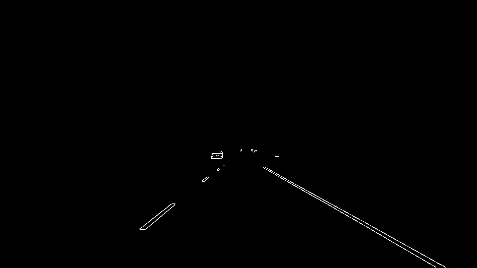
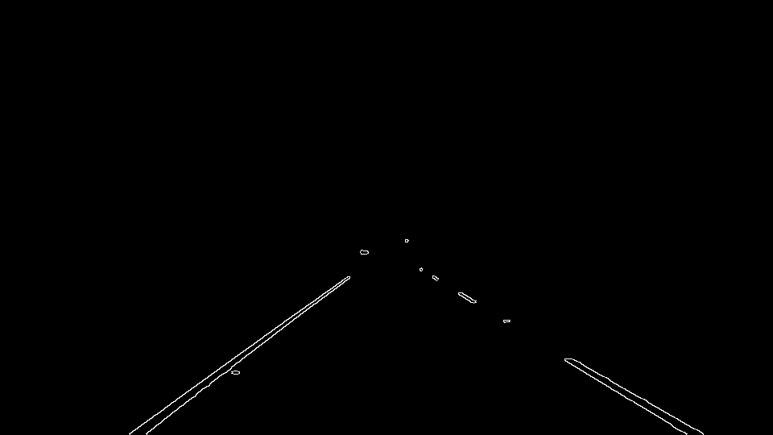
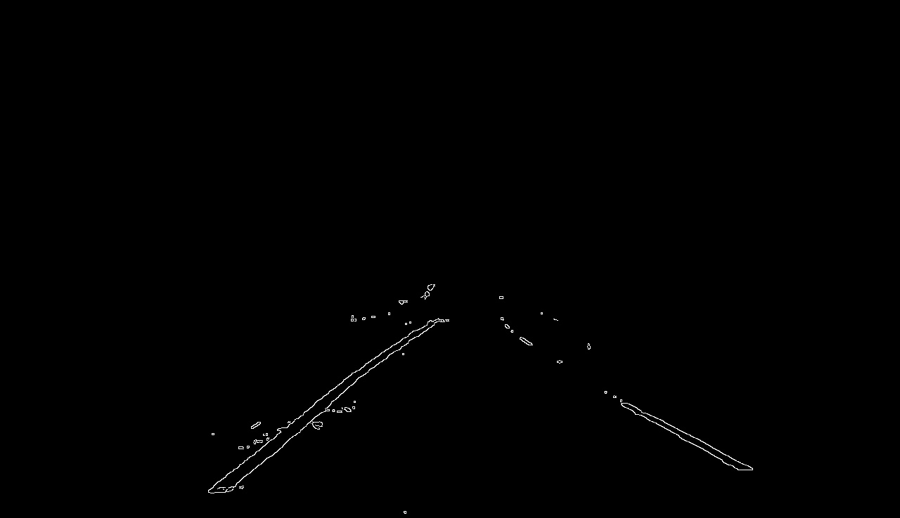


---
###Region of interest definition
To filter out unnecessary objects in the image, the region of interest is defined. Such mask (here it's trapezoid) is then applied to the working image.
```python
def region_of_interest(img, vertices):
    mask = np.zeros_like(img)   
    
    if len(img.shape) > 2:
        channel_count = img.shape[2]  # i.e. 3 or 4 depending on your image
        ignore_mask_color = (255,) * channel_count
    else:
        ignore_mask_color = 255
            
    cv2.fillPoly(mask, vertices, ignore_mask_color)
        
    masked_image = cv2.bitwise_and(img, mask)
    return masked_image
```
```python
yTopMask = imgHeight*0.55
vertices = np.array([[0, imgHeight], [imgWidth*0.45, yTopMask], 
				     [imgWidth*0.55, yTopMask], [imgWidth,imgHeight]], np.int32)
maskedImage = region_of_interest(edgesImage, [vertices])
```

---
###Hough lines detection

Now, having edges detected in our interest area, all straight lines need to be identified. This is done by [Hough transform](http://docs.opencv.org/2.4/doc/tutorials/imgproc/imgtrans/hough_lines/hough_lines.html). This operation has quite many parameters which need to be tuned experimentally.  

```python
rho = 2
theta = np.pi/180
threshold = 15	
min_line_length = 15
max_line_gap = 5

houghLines = cv2.HoughLinesP(maskedImage, rho, theta, threshold, np.array([]), 
                       minLineLength=min_line_length, maxLineGap=max_line_gap)
```
Below, there are tested images with found lines plotted.</br></br>
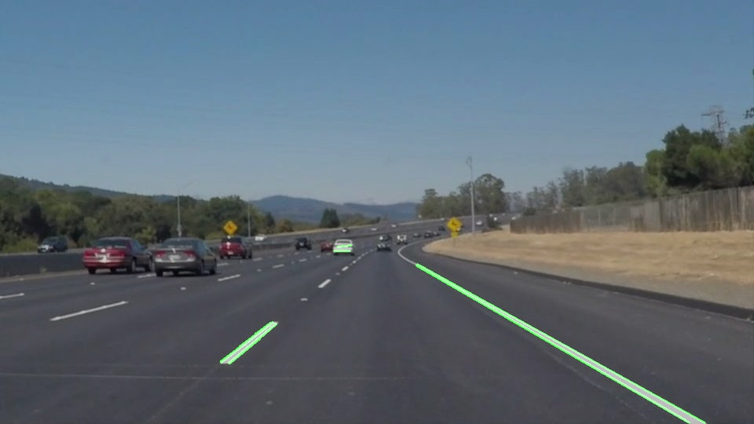
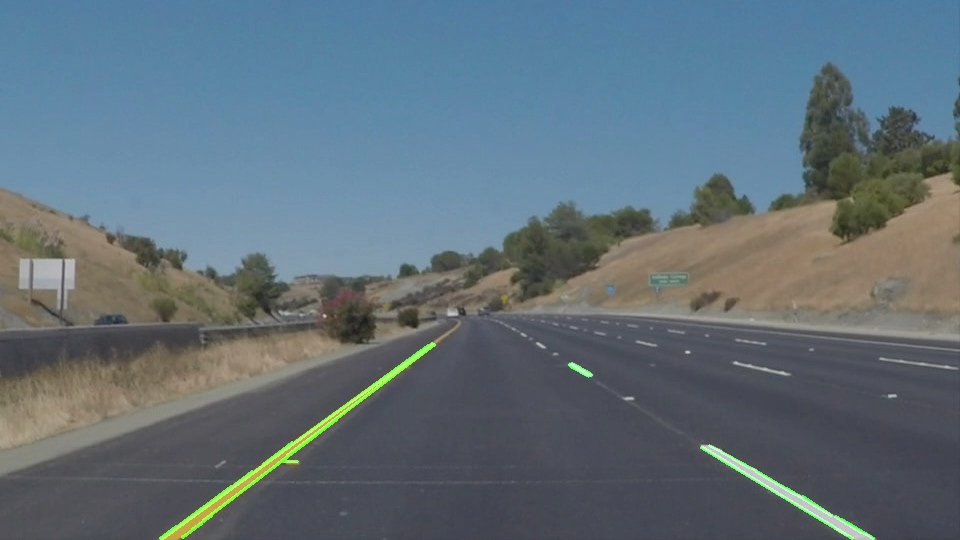


---
###Filtering Hough lines

As we can see above, some line segments are unwanted. For example, small horizontal lines or some lines appearing on cars. Therefore, for each Hough line there is a slope parameter calculated. Only lines with slopes between 17 and 56 degrees are left for further analysis (it correspond to tangents of values 0.3 and 1.5).

```python
for line in houghLines:
	for x1,y1,x2,y2 in line:		
		a = float((y2-y1)/(x2-x1))   		
	   
		if not np.isnan(a) or np.isinf(a) or (a == 0):
			if (a > -1.5) and (a < -0.3) :
				linesFiltered.append(line) 	
			if (a > 0.3) and (a < 1.5) :
				linesFiltered.append(line)
```
Below, there are only filtered Hough lines.</br></br>

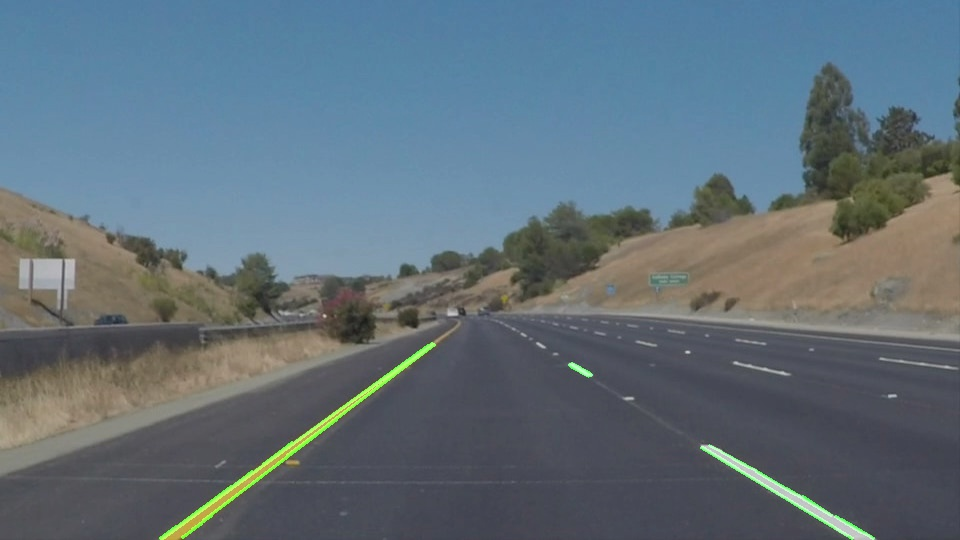
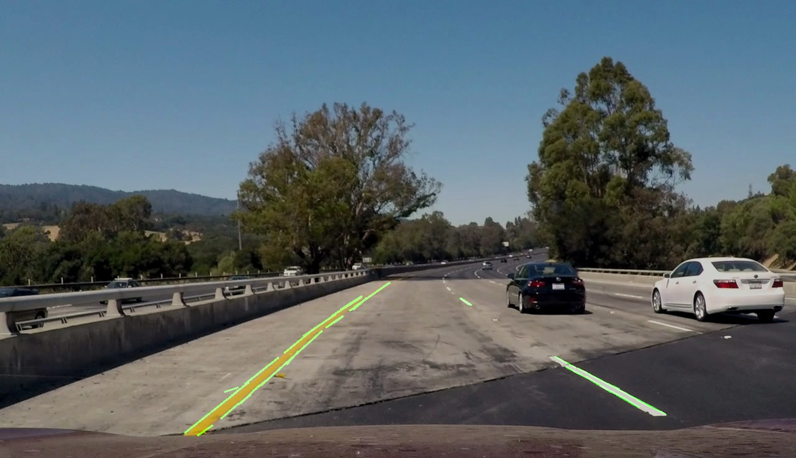

---
###Averaging line segments

All found Hough lines should be right now averaged/extrapolated to produce only two lines representing lanes. The first task is to divide lines into 2 groups (left and right - deduced from the slope sign). Then, one can use best linear fit for the points representing line segments or take an average from these lines. I decided to apply weighted average to calculate resulting slopes and intercepts. Here, lenghts of line segments serve as weights. The longer segment is, the more influence it has on the results. In addition, to amplify the importance of the segment length, the weight is calculated as square the lenght parameter.

```python
for line in houghLines:
	for x1,y1,x2,y2 in line:
		a = float((y2-y1)/(x2-x1))
		b = (y1-a*x1)      
		length = math.sqrt(pow(y2-y1,2)+ pow(x2-x1,2))
	   
		if not np.isnan(a) or np.isinf(a) or (a == 0):
			if (a > -1.5) and (a < -0.3) :
				cumLengthLeft += pow(length,2)
				a_left += a * pow(length,2)
				b_left += b * pow(length,2)

			if (a > 0.3) and (a < 1.5) :               
				cumLengthRight += pow(length,2)
				a_right += a * pow(length,2)
				b_right += b * pow(length,2)
                   

if (cumLengthLeft != 0) :                     
	a_left /= cumLengthLeft    
	b_left /= cumLengthLeft    
 
if (cumLengthRight != 0)  :
	a_right /= cumLengthRight
	b_right /= cumLengthRight
```
The result parameters are *a_left*, *b_left*, *a_right* and *b_right*. Now, having previously defined the *y* positions of output lines, we can calculate their *x* coordinates which give us the full information about the points defining the final lines.

```python
if (a_left!=0):    
    x1_left = int((y_max-b_left)/a_left)
    x2_left = int((y_min-b_left)/a_left)
    
if (a_right!=0): 
    x1_right = int((y_max-b_right)/a_right)
    x2_right = int((y_min-b_right)/a_right)
```
The final output of the pipeline. </br></br>
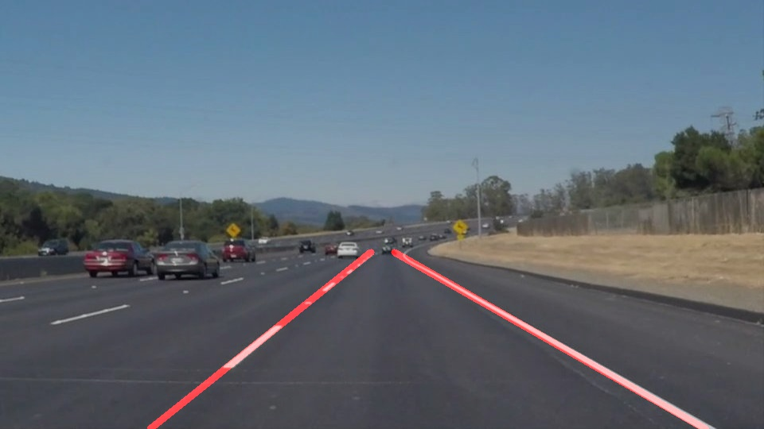

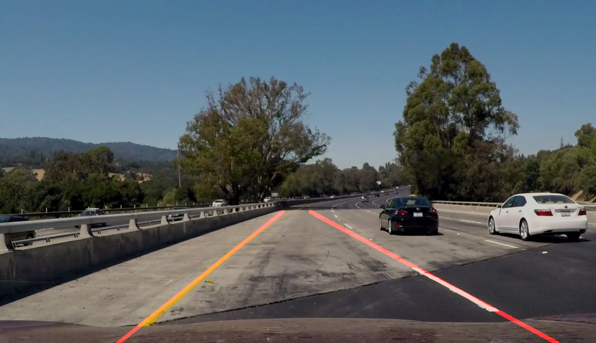

###Applying moving average on final lines

While running the pipeline on the video stream, we can observe that the lines are flickering. To avoid it, we can apply [cumulative moving average](https://en.wikipedia.org/wiki/Moving_average) of the line parameters. For each frame it averages last *n* results including current one. *Cumulative* version of this method applies bigger weights for more recent results. By having in memory the last averaged frame we can also use it in case when no line is found in a frame by some mistake. The possible implementation with *n*=9 is as follows.

```python
def get_averaged_line_params(lineParams, leftHoughLinesExist, rightHoughLinesExist):
    global aLeftStored
    global bLeftStored
    global aRightStored
    global bRightStored    

    param1 = 0.9
    param2 = 0.1

    a_left = lineParams[0]
    b_left = lineParams[1]
    a_right = lineParams[2]
    b_right = lineParams[3]

    if (aLeftStored==0):
        aLeftStored = a_left   
    if (bLeftStored==0):
        bLeftStored = b_left
    if (aRightStored==0):
        aRightStored = a_right
    if (bRightStored==0):
        bRightStored = b_right
        
    if (not leftHoughLinesExist):
        a_left = aLeftStored
    else :
        a_left = aLeftStored * param1 + a_left * param2
        aLeftStored = a_left
        b_left = bLeftStored * param1 + b_left * param2
        bLeftStored = b_left
     
    if (not rightHoughLinesExist):
        a_right = aRightStored
    else : 
        a_right = aRightStored * param1 + a_right * param2
        aRightStored = a_right
        b_right = bRightStored * param1 + b_right * param2
        bRightStored = b_right

    return [a_left, b_left, a_right, b_right]
```
``` python
lineParams = [a_left, b_left, a_right, b_right]
lineParams = get_averaged_line_params(lineParams, leftHoughLinesExist, 
				rightHoughLinesExist)
```
				
>###*Exemplary videos processed by this pipeline can be found in "output_movies" folder*
   
    
##2. Potential shortcomings


One potential shortcoming of the descirbed pipeline would be what would happen when another car appears in our region of interest. It could produce some lines that could be identified as lanes. When applying the pipeline in practice, I think there can be also too many parameters given by a'priori assumptions like lane colors or strictly defined region of interest. The pipeline probably would not work so well when the lanes are curvy or when some white/yellow flat signs are marked on the road.


##3. Possible improvements

A possible improvement would be to use some kind of higher order polynomial fit to handle curvy lanes. 
Also, instead of just guessing/experimenting with many parameters used here, maybe we can automate the process of parameters search. For example by some optimization - having the desired output (ground truth) of many images and processing input images with parameters combinations we could find a perfect set of parameters.
Also, some artificial intelligence methods could be used to learn specific shapes of lanes and then detect them. It could be necessary when the road is without any lane - then more complicated scene understanding algorithms should be required.
